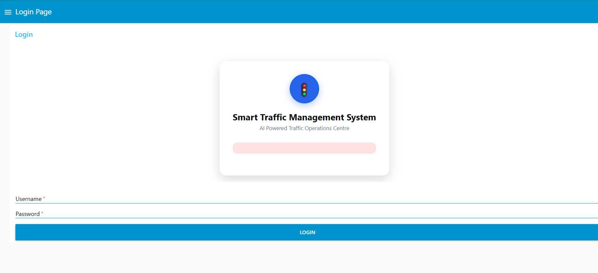

# 🚦 Smart Traffic Management System

<p align="center">
 
</p>

<h1 align="center">🚦 Smart Traffic Management System</h1>

<p align="center">
AI-powered Traffic Operations Platform built with <b>Node-RED</b>, <b>IBM i</b>, <b>IBM Db2</b> and <b>MQTT</b>.
</p>

<p align="center">


</p>

---

# 📖 Overview

The **Smart Traffic Management System** is an intelligent traffic operations platform that simulates a modern smart-city control centre.

It continuously monitors traffic conditions, analyses congestion, detects incidents, prioritises emergency vehicles, logs events into IBM Db2, and provides operators with an AI-powered assistant for decision support.

---

# ✨ Features

- 🚦 Live Traffic Monitoring
- 📊 Traffic Analytics Dashboard
- 🤖 AI Traffic Assistant
- 🚨 Automatic Incident Detection
- 🚑 Emergency Vehicle Priority
- 🔥 Traffic Heat Map
- 🛣 Manual Signal Override
- 📈 Historical Traffic Reports
- 📧 Automated Email Notifications
- 🔐 Secure Login Authentication
- 💾 IBM Db2 Integration
- 📍 Interactive Traffic Map

---

# 🖼 Dashboard Preview

| Login | Dashboard |
|-------|-----------|
|  |  |

| AI Assistant | Flow |
|--------------|-----------|
|  |  |

---

# 🎥 Demo

> Add a GIF or YouTube link here.

```text
docs/demo.gif
```

---

# 🏗 System Architecture

```text
Traffic Sensors (MQTT)
        │
        ▼
   Node-RED Engine
        │
 ┌──────┼──────────────┐
 │      │              │
 ▼      ▼              ▼
AI   IBM Db2      Dashboard
 │
 ▼
Email Notifications
```

---

# 🛠 Technology Stack

| Layer | Technology |
|-------|------------|
| Workflow | Node-RED |
| Database | IBM Db2 |
| Platform | IBM i |
| Messaging | MQTT |
| Language | JavaScript |
| UI | HTML, CSS, Node-RED Dashboard |

---

# 📂 Project Structure

```text
smart-traffic-management-system/
│
├── flows.json
├── README.md
├── LICENSE
├── docs/
│   ├── architecture.png
│   ├── banner.png
│   └── demo.gif
├── screenshots/
│   ├── login.png
│   ├── dashboard.png
│   ├── chatbot.png
│   ├── analytics.png
│   └── map.png
└── sql/
    ├── create_tables.sql
    ├── journaling.sql
    └── sample_data.sql
```

---

# 🚀 Installation

1. Clone the repository.
2. Import `flows.json` into Node-RED.
3. Execute the SQL scripts in IBM Db2.
4. Configure MQTT and Db2 connections.
5. Deploy the flows.
6. Open the dashboard.
7. Login with a valid user.

---

# 📖 Usage

- Monitor live traffic.
- View congestion levels.
- Detect incidents automatically.
- Prioritise emergency vehicles.
- Ask questions using the AI Traffic Assistant.
- Review historical events.
- Receive automated email alerts.

---

# 📸 Main Modules

## 🚦 Traffic Monitoring

Real-time monitoring of multiple traffic junctions.

## 🤖 AI Traffic Assistant

Answers operator questions and generates reports.

## 🚨 Incident Detection

Detects abnormal traffic conditions.

## 🚑 Emergency Management

Automatically prioritises emergency vehicles.

## 📧 Notification Service

Sends alert and recovery emails.

## 🔐 Authentication

IBM Db2-backed login before dashboard access.

---

# 🗄 Database Tables

- TRAFFIC_USERS
- TRAFFIC_JUNCTIONS
- TRAFFIC_HISTORY
- INCIDENTS
- ALERTS
- EMERGENCY_EVENTS

---

# 🗺 Roadmap

- [x] Traffic Monitoring
- [x] AI Assistant
- [x] Emergency Priority
- [x] Email Alerts
- [x] Login System
- [ ] Google Maps Integration
- [ ] ML Traffic Prediction
- [ ] CCTV Integration
- [ ] REST API
- [ ] Mobile Application

---

# 🤝 Contributing

Contributions, ideas, and suggestions are welcome.

1. Fork the repository.
2. Create a feature branch.
3. Commit your changes.
4. Open a Pull Request.

---

# 📄 License

Released under the MIT License.

---

# 👨‍💻 Author

**Manjil Koirala**

MRes Cyber Security  
University of Wolverhampton

---

# ⭐ Support

If you found this project useful:

- ⭐ Star this repository
- 🍴 Fork it
- 💡 Share feedback or suggestions
